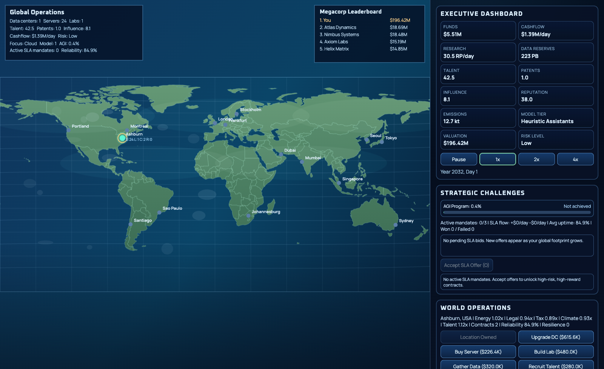

# Megacorp Web Game


_Latest in-game screenshot from the current build._

A browser-based strategy/simulation game where you build a global AI megacorp from a single data center into a planetary-scale company.

## About This Project

This repository is a **prompt test project for Codex** to evaluate how far Codex can take an iterative web-game build from concept to playable result.

## What You Do In The Game

- Start with one data center and limited resources.
- Expand to real-world regions with different energy, legal, tax, climate, and talent multipliers.
- Buy servers, upgrade data centers, build labs, gather data, recruit talent, and file patents.
- Progress through deep research and strategy trees.
- Build and deploy stronger AI model tiers.
- Take enterprise SLA challenge contracts and manage reliability risk.
- Push toward the global objective: **reach AGI** and see exactly which year/day you achieved it.

## Run Locally

### Prerequisites

- Python 3.x (for a simple static server)
- A modern browser (Chrome, Edge, Firefox, Safari)

### Start

From the project root:

```bash
python3 -m http.server 5173
```

Open:

- http://localhost:5173

If port `5173` is already in use, choose another port:

```bash
python3 -m http.server 5174
```

Then open `http://localhost:5174`.

## How To Play

- Click map locations to inspect regional economics.
- Use the right-side operations panel to expand and optimize your business.
- Keep cashflow positive while balancing growth vs risk.
- Accept SLA offers only when your selected site can sustain reliability.
- Harden sites when SLA pressure or regional volatility increases.
- Advance research/strategy and model tiers to accelerate AGI progress.

### Keyboard Controls

- `Arrow Left/Right`: cycle selected location
- `Arrow Up/Down`: cycle market focus
- `A`: acquire location (or upgrade DC if owned)
- `B`: build lab
- `C`: buy server cluster
- `D`: recruit talent
- `E`: file patent
- `H`: harden site
- `K`: sign enterprise contract
- `L`: policy campaign
- `O`: accept SLA offer
- `Enter`: start next available research
- `P`: start next available strategy
- `+` / `-` / `0`: map zoom in/out/reset
- Mouse wheel: zoom map
- Drag map: pan (when zoomed)
- `F`: fullscreen

## Tech

- Plain HTML/CSS/JavaScript
- Canvas-based world rendering
- Real-world map geometry via GeoJSON

## Notes

- `progress.md` contains implementation history and balancing notes.
- `window.render_game_to_text` and `window.advanceTime(ms)` are exposed for automated testing workflows.
